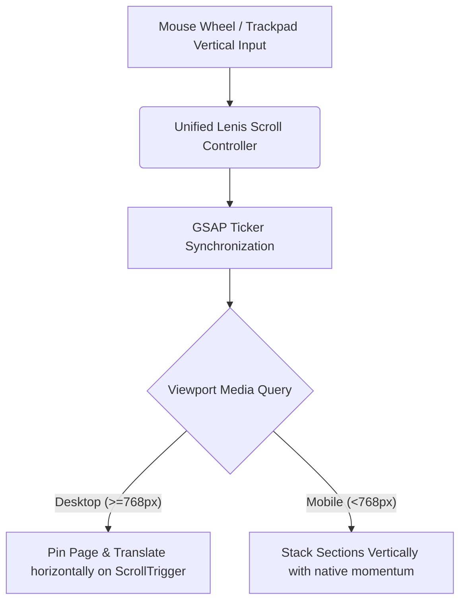

<div align="center">

</div>

# THE DOT — Premium Digital Portfolio

THE DOT is a premium, high-performance web application designed for a state-of-the-art creative agency. The project is engineered around immersive, fluid motion, organic layout transitions, and elite typography.

---

## ⚡ How It Works (Core Mechanics & Architecture)

THE DOT stands out through a bespoke scrolling engine that merges traditional mouse-wheel/touchpad vertical scrolls into dynamic horizontal sweeping motions across different portfolio chapters.



### 1. Vertical-to-Horizontal Pinning Layout
* **File:** `src/components/HorizontalScroll.tsx`
* **Mechanism:** When viewport width matches desktop parameters ($\ge 768\text{px}$), the layout registers a master GSAP ScrollTrigger. The scroll container pins itself (`pin: true`) at `top top` of the viewport. As the user scrolls vertically, GSAP translates the horizontal slider `x` position by:
  $$\Delta x = -(\text{scrollWidth} - \text{innerWidth})$$
* **Responsive Stack:** Below $768\text{px}$, the layouts dynamically un-pin and stack vertically, ensuring optimal readability and zero zoom-lock bugs on mobile viewports.

### 2. High-Performance Smooth Scroll Synchronization
* **File:** `src/hooks/useSmoothScroll.ts`
* **Mechanism:** We use a centralized `Lenis` smooth scroll engine. To completely eliminate frame-rate micro-stutters and visual coordinate misalignment (especially on high-refresh-rate $120\text{Hz}$ or $144\text{Hz}$ screens), Lenis is directly synchronized with GSAP's rendering lifecycle loop:
  ```typescript
  const updateTicker = (time: number) => {
    lenis.raf(time * 1000); // Translate seconds from GSAP to milliseconds
  };
  gsap.ticker.add(updateTicker);
  ```
* **Optimized Easing:** Built with an organic exponential deceleration curve `(t) => Math.min(1, 1.001 - Math.pow(2, -10 * t))` that creates high dynamic friction and ultra-premium ease-outs.

### 3. GPU Compositor Layer Acceleration
* Large creative assets (such as the Hero background and the main Horizontal scrolling viewports) are promoted directly to the GPU using CSS `will-change: transform`. This completely bypasses standard browser CPU repaints on every mouse event, guaranteeing solid $60/120\text{fps}$ rendering.

---

## 🛠️ Tech Stack

* **Frontend Framework:** React 19 + TypeScript
* **Styling Engine:** Tailwind CSS v4 (Vanilla Modern Architecture)
* **Animation Suite:**
  * **GSAP & ScrollTrigger:** Drives structural scroll pinning, parallax transitions, and letter scatter reveals.
  * **Lenis:** Handles physical scroll wheel inertia and easing curves.
  * **Motion (formerly Framer Motion):** Controls component entry/exit fades and glassmorphic card translations.
* **Build System:** Vite (Lightning-fast HMR)

---

## 🚀 Running Locally

### Prerequisites
Make sure you have [Node.js](https://nodejs.org/) installed.

1. **Install dependencies:**
   ```bash
   npm install
   ```

2. **Setup environment variables:**
   Ensure [.env](.env) is configured correctly.

3. **Start the development server:**
   ```bash
   npm run dev
   ```

4. **Verify types & production compilations:**
   ```bash
   npx tsc --noEmit
   npm run build
   ```
